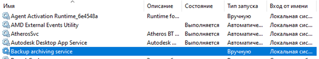

# backup-archiving-service
Backup service for OS Windows

Программа создает сервис MS Windows.
Сервис осуществляет резервное копирование данных из указанной директории.

Структура SERVICE_TABLE_ENTRY используется функцией StartServiceCtrlDispatcher, чтобы задать функцию ServiceMain для службы, которая может запуститься в вызывающем процесс. Эта (ServiceMain()) функция является точкой входа в сервис. Где происходит регистрация обработчика управления службами при помощи функции RegisterServiceCtrlHandler(). 
Для изменения статуса сервиса используется функция ReportStatusToSCMgr(). 
Функция ControlHandler() обрабатывает запросы. Она вызывается каждый раз, как SCM шлет запросы на изменение состояния сервиса.

Для архивации сервис использует внешнюю программу "WinRAR", путь к которой содержится в файле конфигурации. 

После каждого события, возникающего в директории для создания backup (создание, изменение, удаление, переименование…), сервис пытается создать (если архива еще не было) или обновить архив backupFiles.

В результате выполнения программы создется сервис с именем «Backup archiving service», его запуск должен осуществляться вручную.
